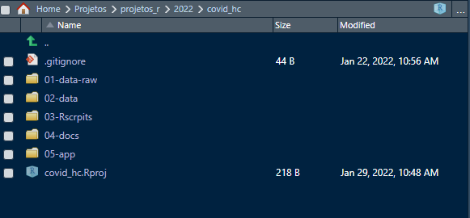
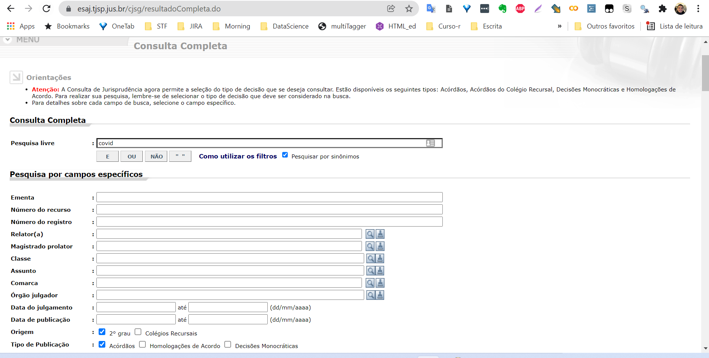
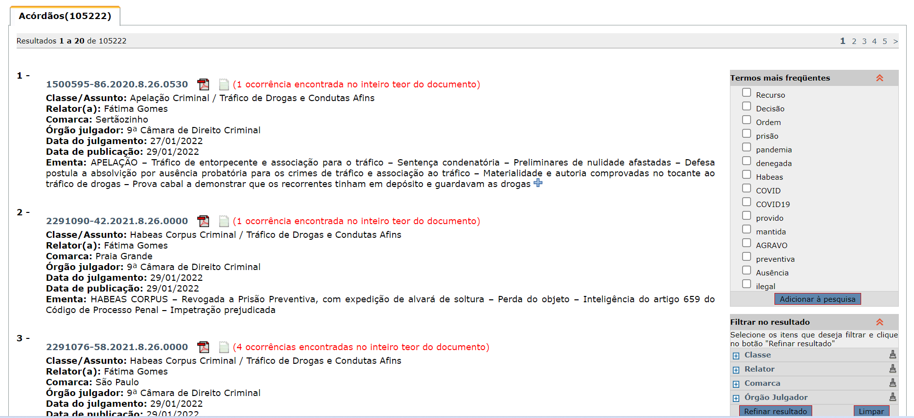
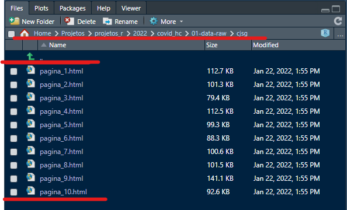

```{r setup, include=FALSE}
knitr::opts_chunk$set(echo = TRUE)
require(remotes)
require(tjsp)
```

## Preparação

Primeiramente instalar o R ([https://cran-r.c3sl.ufpr.br/](https://cran-r.c3sl.ufpr.br/)) e depois instalar o R-Studio ([https://www.rstudio.com/products/rstudio/download/](https://www.rstudio.com/products/rstudio/download/)). Baixe a versão Free do R-Studio que já é suficiente para as análises.

**Algumas referências**

- [https://www.ibpad.com.br/blog/analise-de-dados/aprenda-instalar-o-r-e-o-r-studio/](https://www.ibpad.com.br/blog/analise-de-dados/aprenda-instalar-o-r-e-o-r-studio/)
- [https://didatica.tech/como-instalar-a-linguagem-r-e-o-rstudio/](https://didatica.tech/como-instalar-a-linguagem-r-e-o-rstudio/)

## Introdução

Este projeto buscará verificar a hipótese de que o risco de contaminação por COVID-19 seja um argumento válido para a concessão de Habeas Corpus no Tribnunal de Justiça de São Paulo. Para tanto, a pesquisa levantou todas as decisões de segunda instância em HC do TJSP com a palavra "COVID".

Acesse o site da consulta processual [aqui](https://esaj.tjsp.jus.br/cjsg/resultadoCompleta.do).

Acesse o site do pacote do

## Introdução ao R

```{r eval=FALSE, message=FALSE, warning=FALSE, include=TRUE}
## Demonstração do R

# Matemática
2+2
2*5
3*8

# Atribuição de valor a um objeto
m <- 3*8
n <- 2*3
# dividir um pelo outro
m/n
```

```{r echo=TRUE, message=FALSE, warning=FALSE}
# Gráfico
hist(rnorm(1000))
```

```{r eval=FALSE, message=FALSE, warning=FALSE, include=TRUE}
###Objetos no R

## interger (inteiros)
1L
inteiro <- 2L
inteiro2 <- 3L
2L+3L
inteiro+inteiro2
typeof(inteiro)
is.integer(inteiro)
is.double (inteiro2)
is.numeric(inteiro)

## Double (números reais - não inteiros)
2.5
3.4
pi
double1 <- 2.5
double2 <- 3.4
typeof(double1)
is.integer(double2)
is.numeric(double2)

## caracter 
nome <- "Carlos"
nome2 <- "Luisa"
numero <- "2"
numero2 <- "3"
numero+numero2 # vai apresentar R, pois é um caracter.

# O R não realiza cálculo quando o objeto está classificado como texto. Para calcular, é preciso converter para numérico
as.numeric(numero) + as.numeric(numero2)

## Data (observar a forma de uso da data no R)
data1 <- "2022-01-22"
data1 <- as.Date(data1)
data2 <- as.Date("2022-01-01")
data1 - data2
class(data1)
typeof(data1)
as.numeric(data1)
as.numeric(data2)
data3 <- as.Date("1969-12-20")
as.numeric(data3)

## Factors (Sequência de valores definidos por níveis, ex. variável categórica)
nomes <- c("Ariadne", "David", "Lucas", "Ariadne", "Lucas")
nomes <- as.factor(nomes)
levels(nomes)
as.numeric(nomes)
as.character(nomes)
numeros2 <- c(1,2,3,4,5,6,99, 99, 99, 104, 104, 104, 104, 104,400,5000)
numeros2 <- as.factor(numeros2)
levels(numeros2)
as.numeric(numeros2)
as.numeric(as.character(numeros2))

## Vectors (conjunto de caracteres alfanuméricos)
nomes <- c("Ariadne", "Davi", "Lucas")
numeros1 <- 1:10
numeros2 <- c(1,2,3,4,5,6,99,104,400,5000)
datavetor <- as.Date(c("2022-01-01", "2022-01-22"))

## Dataframes (objetos de 2 dimensões que pode misturar colunas de classes diferentes)
df <- data.frame(
  nome = c("Fux", "Toffoli", "Carmen", "Weber", "Gilmar"),
  decisao = c("provido", "improvido", "extinto", "feliz", "infeliz")
  )
class(df)
typeof(df)
df[1]
df[[1]]

## Matrizes (vetor bidimensional constituído por linhas e colunas com objetos de mesma classe)
matriz <- matrix(numeros1, ncol = 2)

## Listas
lista <- list(nomes, df, matriz, 2, "Gustavo")
lista <- list(nomes=nomes, dataframe=df, m=matriz, numero=2, nonproprio="Gustavo")
lista[3]
lista[1]
lista[[1]]
lista$nomes
lista["nomes"]

## Funções
Sys.time()
sqrt(4)

## Verificar o diretório
getwd()

## criar novos diretórios para salvar os arquivos que serão baixados
dir.create("data")
dir.create("data-raw")
dir.create("data/cjsg")
dir.create("data-raw/cjsg")
dir.create("data-raw/cposg")


```

**Bibliografia Complementar**

-   <https://www.tidytextmining.com>

-   <https://smltar.com>

## Preparação do ambiente

### Instalar os pacotes

```{r eval=FALSE, include=TRUE}
# Instalação dos Pacotes
install.packages("remotes")
install.packages("tidyverse")
install.packages("writexl")
remotes::install_github("jjesusfilho/tjsp", force = TRUE)
remotes::install_github("jjesusfilho/stf")
remotes::install_github("jjesusfilho/stj")
remotes::install_github("jjesusfilho/JurisVis")

```

A organização dos nossos arquivos:



Dentro da pasta `01-data-raw` vamos criar as pastas **cjsg** e **cposg**.

### Consulta a Jurisprudência

Essa etapa é como se estivéssemos indo ao site e buscando a palavra chave covid:



Basicamente listamos os processos na pasta **cjsg**.



#### Código R

```{r eval=FALSE, include=TRUE}

# Leitura da consulta processual ------------------------------------------


# baixar os casos de covid - consulta jurisprudencial
tjsp_baixar_cjsg(
  livre = "covid",
  classe = "307",
  diretorio = "01-data-raw/cjsg",
  # baixa os 10 primeiros
  n = 10
)

# lista os caminhos do arquivo
arquivos <- list.files("01-data-raw/cjsg", full.names = T)

# leitura das decisões e tabela os dados
cjsg <- tjsp_ler_cjsg(arquivos)

```

Veja no R a pasta como ficou:



### Consultar Processo

Com as páginas baixadas, vamos agora consultar os processos. Para isso vamos usar as funções relacionas da `_cposg`.

#### Código R

```{r eval=FALSE, include=TRUE}

# Leitura do processo em si --------------------------------------------

# baixar o cposg - segunda instancai
tjsp_baixar_cposg(cjsg$processo[1:10],
                  diretorio = "01-data-raw/cposg")

# lista o arquivo agora com cposg
arquivos <- list.files("01-data-raw/cposg", full.names = T)

# transforma numa tabela
cposg <- ler_dados_cposg(arquivos)

# somente advogado
# autenticar() #-> esta liberado

# baixar partes
partes <- tjsp_ler_partes(arquivos)

# baixar movimentacao
movimentacao <- ler_movimentacao_cposg(arquivos)

# dispositivo -> decisao
dispositivo <- tjsp_ler_dispositivo(arquivos)

# classifica a decisão, conforme texto do dispositivo
dispositivo$decisao <- tjsp_classificar_writ(dispositivo$dispositivo)
```
